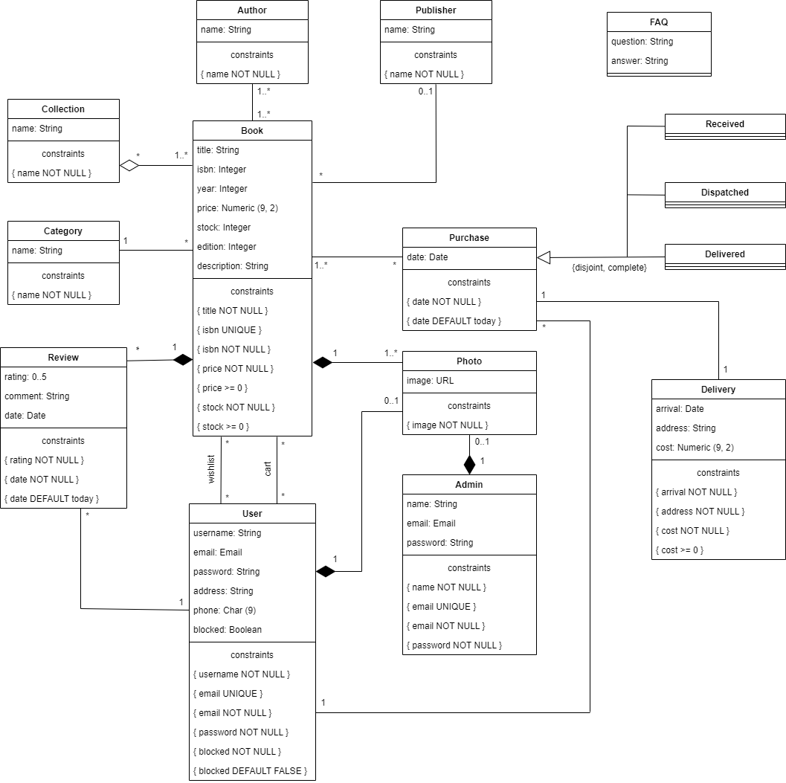

# EBD: Database Specification Component

This is it! The book you need, the experience you want, whenever you like.

## A4: Conceptual Data Model

The Conceptual Data Model contains the identification and description of the entities and relationships that are relevant to the database specification.

### 1. Class diagram

The UML diagram in Figure 1 presents the main organisational entities, the relationships between them, attributes and their domains, and the multiplicity of relationships for the **Off The Shelf** platform.

  

Figure 1: Off The Shelf conceptual data model in UML.

### 2. Additional Business Rules
 
> Business rules can be included in the UML diagram as UML notes or in a table in this section.

---

## A5: Relational Schema, validation and schema refinement

This artifact contains the Relational Schema obtained by mapping from the Conceptual Data Model. The Relational Schema includes each relation schema, attributes, domains, primary keys, foreign keys and other integrity rules: UNIQUE, DEFAULT, NOT NULL, CHECK.

### 1. Relational Schema

A textual compact notation is used to document the relational schemas. 

| Relation reference | Relation Compact Notation                        |
| ------------------ | ------------------------------------------------ |
| R01                | faq (**question**, **answer**)|
| R02                | admin (**id_admin**, name NN, email UK NN, password NN)|
| R03                | photo (**id_photo**, image NN, id_book->book, id_user->user UK, id_admin->admin UK)|
| R04                | publisher (**id_publisher**, name NN)|
| R05                | author (**id_author**, name NN)|
| R06                | book_author (**id_book**->book, **id_author**->author)|
| R07                | collection (**id_collection**, name NN)|
| R08                | book_collection (**id_book**->book, **id_collection**->collection)|
| R09                | category (**id_category**, name NN)|
| R10                | review (**id_review**, rating NN CK rating>0 AND rating<=5, comment, date NN, id_book->book NN, id_user->user NN)|
| R11                | purchase (**id_purchase**, date NN, id_user->user NN)|
| R12                | received (**id_purchase**->purchase)|
| R13                | dispatched (**id_purchase**->purchase)|
| R14                | delivered (**id_purchase**->purchase)|
| R15                | purchase_book (**id_purchase**->purchase, **id_book**->book)|
| R16                | delivery (**id_delivery**, arrival NN, address NN, cost NN CK cost >= 0, id_purchase->purchase UK NN)|
| R17                | book (**id_book**, title NN, isbn NN, year, price NN CK price >= 0, edition, id_category->category NN, id_publisher->publisher)|
| R18                | user (**id_user**, username NN, email UK NN, password NN, address, phone)|
| R19                | wishlist (**id_user**->user, **id_book**->book)|
| R20                | cart (**id_user**->user, **id_book**->book)|

Legend:
 - UK = UNIQUE KEY
 - NN = NOT NULL
 - DF = DEFAULT
 - CK = CHECK

### 2. Domains

Specification of additional domains:

| Domain Name | Domain Specification           |
| ----------- | ------------------------------ |
| Today	      | DATE DEFAULT CURRENT_DATE      |
| State    | ENUM ('Received','Dispached','Delivered') |

### 3. Schema validation

To validate the Relational Schema obtained from the Conceptual Data Model, all functional dependencies are identified and the normalization of all relation schemas is accomplished.

| **TABLE R01**   | faq                |
| --------------  | ---                |
| **Keys**        | {question, answer} |
| **Functional Dependencies:** |       |
| none           |none                |
| **NORMAL FORM** | BCNF               |

| **TABLE R02**   | admin              |
| --------------  | ---                |
| **Keys**        | {id_admin}, {email} |
| **Functional Dependencies:** |       |
| FD0201          | {id_admin} -> {name, email, password}  |
| FD0202          | {email} -> {id_admin, name, password}  |
| **NORMAL FORM** | BCNF               |

| **TABLE R03**   | photo             |
| --------------  | ---                |
| **Keys**        | {id_photo}, {id_user}, {id_admin} |
| **Functional Dependencies:** |       |
| FD0301          | {id_photo} -> {image, id_book, id_user, id_admin}  |
| FD0302          | {id_user} -> {id_photo, image, id_book, id_admin}  |
| FD0303          | {id_admin} -> {id_photo, image, id_book, id_user}  |
| **NORMAL FORM** | BCNF               |

| **TABLE R04**   | publisher             |
| --------------  | ---                |
| **Keys**        | {id_publisher} |
| **Functional Dependencies:** |       |
| FD0401          | {id_publisher} -> {name}  |
| **NORMAL FORM** | BCNF               |

| **TABLE R05**   | author             |
| --------------  | ---                |
| **Keys**        | {id_author} |
| **Functional Dependencies:** |       |
| FD0501          | {id_author} -> {name}  |
| **NORMAL FORM** | BCNF               |

| **TABLE R06**   | book_author             |
| --------------  | ---                |
| **Keys**        | {id_book, id_author} |
| **Functional Dependencies:** |       |
| none|none  |
| **NORMAL FORM** | BCNF               |

| **TABLE R07**   | collection             |
| --------------  | ---                |
| **Keys**        | {id_collection} |
| **Functional Dependencies:** |       |
| FD0701          | {id_collection} -> {name}  |
| **NORMAL FORM** | BCNF               |

| **TABLE R08**   | book_collection             |
| --------------  | ---                |
| **Keys**        | {id_book, id_collection} |
| **Functional Dependencies:** |       |
| none|none  |
| **NORMAL FORM** | BCNF               |

| **TABLE R09**   | category             |
| --------------  | ---                |
| **Keys**        | {id_category} |
| **Functional Dependencies:** |       |
| FD0901          | {id_category} -> {name}  |
| **NORMAL FORM** | BCNF               |

| **TABLE R10**   | review             |
| --------------  | ---                |
| **Keys**        | {id_review} |
| **Functional Dependencies:** |       |
| FD1001          | {id_review} -> {rating, comment, date, id_book, id_user} |
| **NORMAL FORM** | BCNF               |

| **TABLE R11**   | puchase            |
| --------------  | ---                |
| **Keys**        |  {id_purchase} |
| **Functional Dependencies:** |       |
| FD1101          | {id_purchase} -> {date, id_user} |
| **NORMAL FORM** | BCNF               |

| **TABLE R12**   |received            |
| --------------  | ---                |
| **Keys**        |  {id_purchase} |
| **Functional Dependencies:** |       |
| none|none  |
| **NORMAL FORM** | BCNF               |

| **TABLE R13**   | dispached           |
| --------------  | ---                |
| **Keys**        |  {id_purchase} |
| **Functional Dependencies:** |       |
| none|none  |
| **NORMAL FORM** | BCNF               |

| **TABLE R14**   | delivered          |
| --------------  | ---                |
| **Keys**        |  {id_purchase} |
| **Functional Dependencies:** |       |
| none|none  |
| **NORMAL FORM** | BCNF               |

| **TABLE R15**   | purchase_book          |
| --------------  | ---                |
| **Keys**        |  {id_purchase, id_book} |
| **Functional Dependencies:** |       |
| none|none  |
| **NORMAL FORM** | BCNF               |

| **TABLE R16**   | delivery         |
| --------------  | ---                |
| **Keys**        |  {id_delivery}, {id_purchase} |
| **Functional Dependencies:** |       |
| FD1601          | {id_delivery} -> {arrival, address, cost, id_purchase} |
| FD1602          | {id_purchase} -> {id_delivery, arrival, address, cost} |
| **NORMAL FORM** | BCNF               |

| **TABLE R17**   | book         |
| --------------  | ---                |
| **Keys**        | {id_book} |
| **Functional Dependencies:** |       |
| FD1701          | {id_book} -> {title, isbn, year, price, edition, id_category, id_publisher} |
| **NORMAL FORM** | BCNF               |

| **TABLE R18**   | user         |
| --------------  | ---                |
| **Keys**        |{id_user}, {email} |
| **Functional Dependencies:** |       |
| FD1801          | {id_user} -> {username, email, password, address, phone} |
| FD1802          | {email} -> {id_user, username, password, address, phone}|
| **NORMAL FORM** | BCNF               |

| **TABLE R19**   | wishlist         |
| --------------  | ---                |
| **Keys**        | {id_user, id_book} |
| **Functional Dependencies:** |       |
| none|none  |
| **NORMAL FORM** | BCNF               |

| **TABLE R20**   | cart         |
| --------------  | ---                |
| **Keys**        | {id_user, id_book} |
| **Functional Dependencies:** |       |
| none|none  |
| **NORMAL FORM** | BCNF               |

Because all relations are in the Boyce–Codd Normal Form (BCNF), the relational schema is also in the BCNF and, therefore, the schema does not need to be further normalised.

---

## A6: Indexes, triggers, transactions and database population

This artifact contains the physical schema of the database, the identification and characterisation of the indexes, the support of data integrity rules with triggers and the definition of the database user-defined functions.

Furthermore, it also shows the database transactions needed to assure the integrity of the data in the presence of concurrent accesses. For each transaction, the isolation level is explicitly stated and justified.

This artifact also contains the database's workload as well as the complete database creation script, including all SQL necessary to define all integrity constraints, indexes and triggers. Finally, this artifact also includes a separate script with INSERT statements to populate the database.

### 1. Database Workload
 
The workload includes an estimate of the number of tuples for each relation and also the estimated growth.

| **Relation reference** | **Relation Name** | **Order of magnitude**        | **Estimated growth** |
| ------------------ | ------------- | ------------------------- | -------- |
| R01                | faq        | dozens | one per month |
| R02                | admin        | units | no growth |
| R03                | photo        | tens of thousands | dozens per day |
| R04                | publisher        | hundreds | one per day |
| R05                | author       | thousands | one per day |
| R06                | book_author        | thousands | ... |
| R07                | collection        | hundreds | no growth |
| R08                | book_collection        | hundreds | ... |
| R09                | category        | hundreds | no growth |
| R10                | review        | thousands | no growth |
| R11                | purchase        | tens of thousands | no growth |
| R12                | received        | tens of thousands | no growth |
| R13                | dispatched        | tens of thousands | no growth |
| R14                | delivered        | tens of thousands | no growth |
| R15                | purchase_book        | tens of thousands | ... |
| R16                | delivery        | tens of thousands | no growth |
| R17                | book       | tens of thousands | dozens per day |
| R18                | user        | tens of thousands | dozens per day |
| R19                | wishlist        | tens of thousands | ... |
| R20                | cart        | tens of thousands | ... |

### 2. Proposed Indices

#### 2.1. Performance Indices
 
> Indices proposed to improve performance of the identified queries.

| **Index**           | IDX01                                  |
| ---                 | ---                                    |
| **Relation**        | Relation where the index is applied    |
| **Attribute**       | Attribute where the index is applied   |
| **Type**            | B-tree, Hash, GiST or GIN              |
| **Cardinality**     | Attribute cardinality: low/medium/high |
| **Clustering**      | Clustering of the index                |
| **Justification**   | Justification for the proposed index   |
| `SQL code`                                                  ||

#### 2.2. Full-text Search Indices 

> The system being developed must provide full-text search features supported by PostgreSQL. Thus, it is necessary to specify the fields where full-text search will be available and the associated setup, namely all necessary configurations, indexes definitions and other relevant details.  

| **Index**           | IDX01                                  |
| ---                 | ---                                    |
| **Relation**        | Relation where the index is applied    |
| **Attribute**       | Attribute where the index is applied   |
| **Type**            | B-tree, Hash, GiST or GIN              |
| **Clustering**      | Clustering of the index                |
| **Justification**   | Justification for the proposed index   |
| `SQL code`                                                  ||

### 3. Triggers
 
> User-defined functions and trigger procedures that add control structures to the SQL language or perform complex computations, are identified and described to be trusted by the database server. Every kind of function (SQL functions, Stored procedures, Trigger procedures) can take base types, composite types, or combinations of these as arguments (parameters). In addition, every kind of function can return a base type or a composite type. Functions can also be defined to return sets of base or composite values.  

| **Trigger**      | TRIGGER01                              |
| ---              | ---                                    |
| **Description**  | Trigger description, including reference to the business rules involved |
| `SQL code`                                             ||

### 4. Transactions
 
> Transactions needed to assure the integrity of the data.  

| SQL Reference   | Transaction Name                    |
| --------------- | ----------------------------------- |
| Justification   | Justification for the transaction.  |
| Isolation level | Isolation level of the transaction. |
| `Complete SQL Code`                                   ||

## Annex A. SQL Code

> The database scripts are included in this annex to the EBD component.
> 
> The database creation script and the population script should be presented as separate elements.
> The creation script includes the code necessary to build (and rebuild) the database.
> The population script includes an amount of tuples suitable for testing and with plausible values for the fields of the database.
>
> The complete code of each script must be included in the group's git repository and links added here.

### A.1. Database schema

> The complete database creation must be included here and also as a script in the repository.

### A.2. Database population

> Only a sample of the database population script may be included here, e.g. the first 10 lines. The full script must be available in the repository.

---

## Revision history

Changes made to the first submission:
1. Item 1
1. ..

***
GROUP21gg, DD/MM/2021
 
* Group member 1 name, email (Editor)
* Group member 2 name, email
* ...
