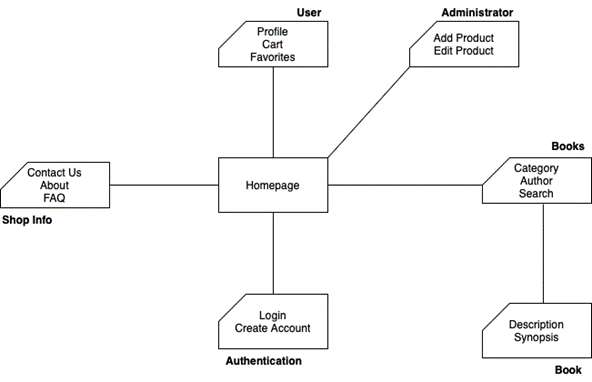
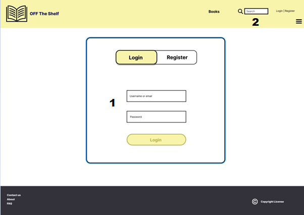
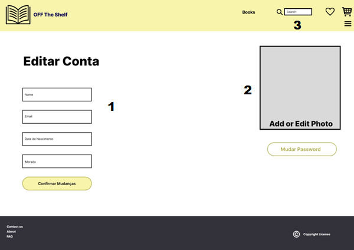

# ER: Requirements Specification Component

This is it! The book you need, the experience you want, whenever you like.

## A1: Off The Shelf

The Off The Shelf project consists in a web application that serves as an online shop made exclusively for books of all types and categories. 
This project, developed by our group, will be useful for those who are trying to buy some books online and have them delivered to their homes.
What motivates this idea are the people who want to find the perfect book to read (amongst so many that are available) and get the physical item for a real experience.  

We pretend to build a system with an adaptive and practical design, and a good product organization in order to help the user quickly find the ideal book with little to no effort.
The users will be able to create an account for themselves and login/logout as needed. Regarding the website administration, there's some sort of control (access and modification privileges) over user accounts and products.
This web application will also provide the users with a categorization system for the books as well as some search filters such as search by author, by year, by the publisher, etc.
The books will be displayed with pictures and their respective information. All of them contain a review section, where buyers can submit a commentary and leave a score. Users will also receive notifications, regarding order status for instance.

The platform will be used by different groups with distinct permissions. The administrators, having complete access, can add books and manage their information and manage all user accounts as well as update the orders' state. However, they cannot buy products. As for the rest of the users, the guests (non-authenticated) can browse books and categories, view reviews and other details, and also add items to a shopping cart. On the other hand, authenticated users, while being able to perform the same tasks as guests, can also view/edit their own profiles, purchase books and submit reviews. In addition to that, they have a wishlist to which they can add some of their desired books.

---

## A2: Actors and User stories

This artifact contains the specification of the actors and their user stories, serving as agile documentation of the project’s requirements.

### 1. Actors

  

Figure 1: Off The Shelf actors.  

| Identifier           | Description                                                                                                                                                                                        |
|----------------------|----------------------------------------------------------------------------------------------------------------------------------------------------------------------------------------------------|
| User                 | Generic user that has access to public information, such as published titles, and can search products and manage a shopping cart.                                                                  |
| Visitor              | Unauthenticated user that can register themself or sign-in in the system.                                                                                                                          |
| Authenticated User   | User that can consult information, checkout a shopping cart, manage a wishlist, view purchase history and review a product.                                                                        |
| Buyer                | Authenticated user that purchased some book(s) and can track/cancel an order as well as review a purchased product.                                                                                |
| Administrator        | Responsible for the management of normal users, products information, stock and categorization, along with managing orders' status. The administrator cannot purchase products.                    |  

Table 1: Off The Shelf actors description.

### 2. User Stories  

For the Off The Shelf system, consider the user stories that are presented in the following sections.

#### 2.1. User

| Identifier         | Name                                 | Priority | Description                                                                                                                          |
|--------------------|--------------------------------------|----------|--------------------------------------------------------------------------------------------------------------------------------------|
| US01               | View Products List                   | high     | As a *User*, I want a products list, so that I can see the books that are available in the store.                                    |
| US02               | Browse Product Categories            | high     | As a *User*, I want a filter, so that I can specify the books by category, author, year, publisher, etc.                             |
| US03               | View Product Details                 | high     | As a *User*, I want to be able to see the book's details, so that I get to know more about it.                                       |
| US04               | View Product Reviews                 | high     | As a *User*, I want to be able to see a book reviews, so that I have a vague idea of its quality.                                    |
| US05               | Add Product to Shopping Cart         | high     | As a *User*, I want a shopping cart, so that I can add items that I might want.                                                      |
| US06               | Manage Shopping Cart                 | high     | As a *User*, I want a shopping cart, so that I can manage the items I wanted and decide if I want to remove any of them.             |
| US07               | Search Products                      | high     | As a *User*, I want a search bar, so that I can find the desirable book.                                                             |
| US08               | Product on Cart Price Change         | high     | As a *User*, I want to be notified of changes on the cart's products, so that I am up to date with the current prices.               |  

Table 2: User user stories.

#### 2.2. Visitor

| Identifier | Name                       | Priority | Description                                                                                                                                        |
|------------|----------------------------|----------|----------------------------------------------------------------------------------------------------------------------------------------------------|
| US09       | Sign In                    | high     | As a *Visitor*, I want to authenticate into the system, so that I can access an administrator/authenticated user's privileges.                     |
| US10       | Register                   | high     | As a *Visitor*, I want to register myself into the system, so that I can authenticate myself into the system.                                      |  

Table 3: Visitor user stories.

#### 2.3. Authenticated User

| Identifier         | Name                                   | Priority | Description                                                                                                                                                 |
|--------------------|----------------------------------------|----------|-------------------------------------------------------------------------------------------------------------------------------------------------------------|
| US11               | View Purchase History                  | high     | As an *Authenticated User*, I want a purchase history, so that I can track my purchases along the way.                                                      |
| US12               | Add Products to Wishlist               | high     | As an *Authenticated User*, I want a wishlist, so that I can add books that I might want to it.                                                             |
| US13               | Manage Wishlist                        | high     | As an *Authenticated User*, I want a wishlist, so that I can mantain track of books that I might want to buy.                                               |
| US14               | Review Product                         | high     | As an *Authenticated User*, I want to be able to review a book, so that both the author, shop, and other users can know my opinion on the book.             |
| US15               | Checkout                               | high     | As an *Authenticated User*, I want to be able to checkout my shopping cart, so that I can get the products I want.                                          |
| US16               | Edit Review                            | high     | As an *Authenticated User*, I want to be able to edit a review of mine, so that I can correct mistakes or in case my opinion on the book changes.           |
| US17               | Remove Review                          | high     | As an *Authenticated User*, I want to be able to remove a review of mine, so that other users may not see a review I no longer want to be visible.          |
| US18               | Logout                                 | high     | As an *Authenticated User*, I want to be able to logout, so that I can end my user session at the moment.                                                   |
| US19               | Delete Account                         | high     | As an *Authenticated User*, I want to be able to delete my account, so that it no longer exists on the system.                                              |
| US20               | Product in Wishlist Available          | high     | As an *Authenticated User*, I want to be notified if a product on my wishlist is available, so that I can consider buying it.                               |  

Table 4: Authenticated User user stories.

#### 2.4. Buyer

| Identifier         | Name                                   | Priority | Description                                                                                                                                                 |
|--------------------|----------------------------------------|----------|-------------------------------------------------------------------------------------------------------------------------------------------------------------|
| US21               | Review Purchased Product               | high     | As a *Buyer*, I want to be able to review a purchased book, so that the users can see what my thoughts were on the experience/process.                        |
| US22               | Track Order                            | high     | As a *Buyer*, I want to be able to track my order, so that I know when to expect it and to know if something went wrong with the process in general.          |
| US23               | Cancel Order                           | high     | As a *Buyer*, I want to be able to cancel my order, so that if I no longer want a certain product I purchased, I can return it.                               |
| US24               | Payment Approved                       | high     | As a *Buyer*, I want to be notified if my payment was approved, so that I can be sure that the purchase process is going well.                                |
| US25               | Change in Order Processing Stage       | high     | As a *Buyer*, I want to be notified of a change in the order's processing, so that I'm up to date with this stage.                                            |  

Table 5: Buyer user stories.

#### 2.5. Administrator

| Identifier         | Name                                  | Priority | Description                                                                                                                                                   |
|--------------------|---------------------------------------|----------|---------------------------------------------------------------------------------------------------------------------------------------------------------------|
| US26               | Add Product                           | high     | As an *Administrator*, I want to be able to add books to the store, so that I can keep it updated with new releases.                                          |
| US27               | Manage Products Information           | high     | As an *Administrator*, I want to be able to manage a products information, so that it is updated and users are not mistaken.                                  |
| US28               | Manage Products Stock                 | high     | As an *Administrator*, I want to be able to manage a products stock, so that it is updated and users are not mistaken.                                        |
| US29               | Manage Products Categories            | high     | As an *Administrator*, I want to be able to manage a products categories, so that it is updated and users are not mistaken.                                   |
| US30               | View User's Purchase History          | high     | As an *Administrator*, I want to see a user's purchase history, so that I can see if everything is correct and they are not doing anything nefarious.         |
| US31               | Manage Order Status                   | high     | As an *Administrator*, I want to be able to manage order status, so that I can keep it updated to the user.                                                   |
| US32               | Administer User Accounts              | high     | As an *Administrator*, I want to administrate user accounts, so that I can have some control over them and keep the system clean.                             |
| US33               | Block/Unblock Users                   | high     | As an *Administrator*, I want to block or unblock user accounts, so that the system stays healthy and the users notice some kind of authority.                |
| US34               | Delete User Account                   | high     | As an *Administrator*, I want to delete user accounts, so that the system stays healthy and with no spam/harmful accounts.                                    |  

Table 6: Administrator user stories.

### 3. Supplementary Requirements

This section contains business rules, technical requirements and other non-functional requirements on the project.

#### 3.1. Business rules

| Identifier | Name          | Description                                                                                                                             |
|------------|---------------|-----------------------------------------------------------------------------------------------------------------------------------------|
| BR01       | Admin         | Administrator accounts are independent of the user accounts, i.e. they cannot buy products.                                             |
| BR02       | Book In Stock | A book can only be bought by a authenticated user if there's at least one available in stock.                                           |
| BR03       | Review Score  | Buyers need to give a score to a book in order to submit a review.                                                                      |
| BR04       | Book Info     | When looking at a specific book, the user should be able to see its author, publisher, year, price, a picture and a brief description.  |  

Table 7: Off The Shelf business rules.

#### 3.2. Technical requirements

| Identifier | Name            | Description                                                                                                                                                                                                                   |
|------------|-----------------|-------------------------------------------------------------------------------------------------------------------------------------------------------------------------------------------------------------------------------|
| TR01       | Availability    | The system must be available 99 percent of the time in each 24-hour period.                                                                                                                                                   |
| TR02       | Accessibility   | The system must ensure that everyone can access the pages, regardless of whether they have any handicap or not, or the web browser they use.                                                                                  |
| **TR03**       | **Usability**       | **The system should be simple and easy to use.**                                                                                                                                                                                  |
| TR04       | Performance     | The system should have response times shorter than 2 s to ensure the user's attention.                                                                                                                                        |
| **TR05**       | **Web application** | **The system should be implemented as a web application with dynamic pages (HTML, JavaScript, CSS and PHP).**                                                                                                                     |
| TR06       | Portability     | The server-side system should work across multiple platforms (Linux, Mac OS, etc.).                                                                                                                                           |
| TR07       | Database        | The PostgreSQL database management system must be used.                                                                                                                                                                       |
| **TR08**       | **Security**        | **The system shall protect information from unauthorised access through the use of an authentication and verification system.**                                                                                                   |
| TR09       | Robustness      | The system must be prepared to handle and continue operating when runtime errors occur.                                                                                                                                       |
| TR10       | Scalability     | The system must be prepared to deal with the growth in the number of users and their actions.                                                                                                                                 |
| TR11       | Ethics          | The system must respect the ethical principles in software development (for example, personal user details, or usage data, should not be collected nor shared without full acknowledgement and authorization from its owner). |  

Table 8: Off The Shelf technical requirements.  

- The most critical technical requirements are TR03 (as we want the user to have a pleasent experience), TR05 (determines the way our system is suposed to be developed) and TR08 (since this is a shop and payments/physical products are involved).

#### 3.3. Restrictions

| Identifier | Name     | Description                                                                         |
|------------|----------|-------------------------------------------------------------------------------------|
| C01        | Deadline | The system should be ready to be used mid december.                                 |
| C02        | Workflow | Some project components must be completed until the respective planned deadlines.   |  

Table 9: Off The Shelf project restrictions.

---

## A3: Information Architecture

This artifact presents a brief overview of the information architecture of the system to be developed. It has the following goals: 

1. Help to identify and describe the user requirements, and raise new ones; 
2. Preview and empirically test the user interface of the product to be developed; 
3. Enable quick and multiple iterations on the design of the user interface. 

This artifact includes two elements: 

1. A sitemap, defining how the information is organized in pages; 
2. A set of wireframes, defining the functionality and the content for each page. Wireframes are designed for at least two of the most important pages. 

### 1. Sitemap

A sitemap is a visual representation of the relationship between the different pages of a website that shows how all the information fits together. The sitemap includes all planned pages and provides a high-level view of how the information space is organized. 

From the homepage, you’ll be able to access your user page (as long as you’re logged in), Off The Shelf useful information, and find the book you’re looking for. If you have administrator privileges, it is possible to edit the website and its contents.

  

Figure 1: Off The Shelf sitemap.

### 2. Wireframes

Wireframes are used to describe layout ideas, content, and the overall page-level design. A page wireframe defines how space is allocated and how content is prioritized, including which features are available.
The mock-ups presented are the login and profile pages.

#### Login Page

  

Figure 2: Login wireframe.  

1. Username/email and password fields
2. Direct access to the search feature

#### User Profile Page

  

Figure 3: User Profile wireframe.  

1. Profile information (which the user can edit)
2. User picture (optional)
3. Direct access to the search feature

---

## Revision history

Changes made to the first submission:
1. Business rule which stated usernames were unique was removed. 
2. ...

***
GROUP2232, DD/MM/2022

* Afonso da Silva Pinto, up202008014@fe.up.pt
* Afonso José Pinheiro Oliveira Esteves Abreu, up202008552@fe.up.pt
* Diogo Filipe Ferreira da Silva, up202004288@fe.up.pt
* Rúben Lourinha Monteiro, up202006478@fe.up.pt
